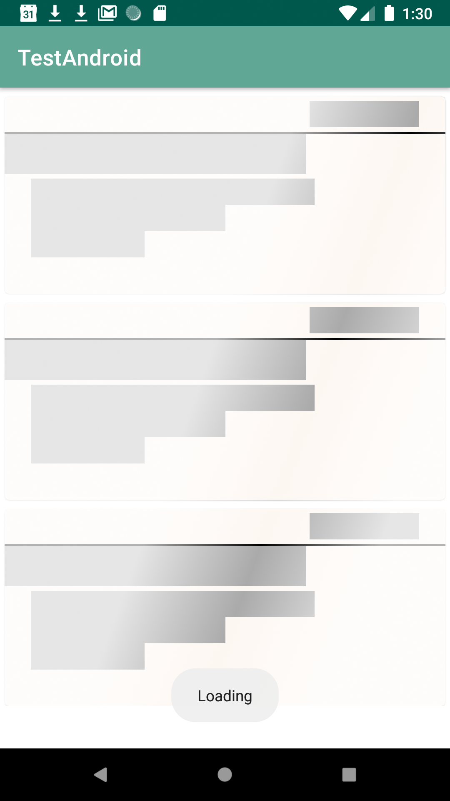
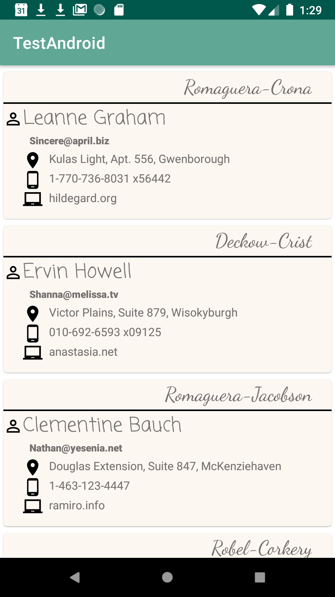

# Android Business Card List
This app display a simple list of business card (user with address info and company info). The app follow most of [Google architecture recommendation](https://developer.android.com/jetpack/docs/guide) to implement patterns like MVVM (Model View ViewModel), SST (Single Source of truth), Single Activity App, ect...
### Dependencies
```groovy
dependencies {
    def retrofit_version = '2.6.2'
    def room_version = '2.2.4'
    def lifecycle_version = '2.2.0'
    def coroutines_version = '1.3.4'
    def timber_version = '4.7.1'
    def recyclerview_version = '1.0.0'
    def material_design = '1.1.0'
    def shimmer_version = '0.5.0'

    // ViewModel
    implementation "androidx.lifecycle:lifecycle-viewmodel-ktx:$lifecycle_version"
    // LiveData
    implementation "androidx.lifecycle:lifecycle-livedata-ktx:$lifecycle_version"
    // Annotation processor
    implementation 'androidx.legacy:legacy-support-v4:1.0.0'
    implementation "androidx.lifecycle:lifecycle-extensions:$lifecycle_version"
    implementation "androidx.lifecycle:lifecycle-viewmodel-ktx:$lifecycle_version"
    kapt "androidx.lifecycle:lifecycle-compiler:$lifecycle_version"

    // Retrofit dependencies
    implementation "com.squareup.retrofit2:retrofit:$retrofit_version"
    implementation "com.squareup.retrofit2:converter-gson:$retrofit_version"

    // Room Persistence library
    implementation "androidx.room:room-runtime:$room_version"
    kapt "androidx.room:room-compiler:$room_version"
    // optional - Kotlin Extensions and Coroutines support for Room
    implementation "androidx.room:room-ktx:$room_version"

    // Coroutines
    implementation "org.jetbrains.kotlinx:kotlinx-coroutines-core:$coroutines_version"

    // Logging
    implementation "com.jakewharton.timber:timber:$timber_version"

    // Recycler View
    implementation "androidx.recyclerview:recyclerview:$recyclerview_version"

    // Material Design
    implementation "com.google.android.material:material:$material_design"

    // Shammer Ui
    implementation "com.facebook.shimmer:shimmer:$shimmer_version"

    implementation fileTree(dir: 'libs', include: ['*.jar'])
    implementation "org.jetbrains.kotlin:kotlin-stdlib-jdk7:$kotlin_version"
    implementation 'androidx.appcompat:appcompat:1.0.2'
    implementation 'androidx.core:core-ktx:1.0.2'
    implementation 'androidx.constraintlayout:constraintlayout:1.1.3'
    testImplementation 'junit:junit:4.12'
    androidTestImplementation 'androidx.test.ext:junit:1.1.0'
    androidTestImplementation 'androidx.test.espresso:espresso-core:3.1.1'
}
```
## Loading Screen
Show a loading affect on list items

## List Screen
When the list is loaded display the list to the user

